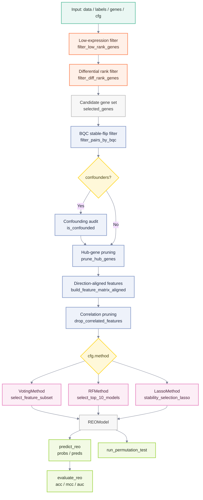

# REOBiomarker: Relative Expression Ordering-based Biomarker Identification

[](https://github.com/pathint/REOBiomarker.jl/actions/workflows/CI.yml?query=branch%3Amain)

REOBiomarker is a Julia package for binary classification biomarker discovery based on
Relative Expression Ordering (REO).  It identifies gene pairs whose expression
ordering is stable in control samples but reversed in case samples, and uses
these pairs as binary features for sample-level prediction.

Because REO uses within-sample gene expression as a reference, it does not
depend on absolute expression values and typically does not require batch
correction, making it suitable for cross-dataset and cross-platform modelling.
The same input structure applies to protein expression or other continuous
quantitative data.

REOBiomarker implements model training, evaluation, and significance testing, and
includes TSP, k-TSP, and AUC-TSP as baseline methods from the literature.


## Input Format

All training and prediction functions expect three objects:

- `data` — expression matrix, **genes × samples**.
- `labels` — binary vector (0 / 1), one entry per sample column.
- `genes` — gene-name vector, one entry per row of `data`.

## Quick Start

```julia
using REOBiomarker

data, labels, genes = generate_test_data(1000, 200)

cfg = REOConfig(
    method = VotingMethod,
    bqc_threshold = 2.0,
    p0_threshold = 0.1,
)

model = fit_reo(data, labels, genes, cfg)
pred  = predict_reo(model, data, genes)
metrics = evaluate_reo(model, data, genes, labels)
```

## Algorithm Overview

For a sample $s$ and the $i$-th direction-aligned gene pair $(A_i, B_i)$,
REOBiomarker converts the ordering into a binary feature:

$$
x_i(s) = \mathbf{1}\{E_{A_i,s} > E_{B_i,s}\}
$$

where $E_{A_i,s}$ and $E_{B_i,s}$ are the expression values of genes $A_i$
and $B_i$ in sample $s$.  $x_i(s)=1$ indicates the pair supports the positive
class; $x_i(s)=0$ indicates it does not.

REOBiomarker supports three classification strategies:

- **VotingMethod** — equal-weight majority vote.  With $n$ selected pairs the
  sample score is

$$
\text{score}(s) = \frac{1}{n}\sum_{i=1}^{n} x_i(s) + b
$$

  where $b$ is a bias calibrated during training; when $b=0$ this reduces to
  ordinary majority voting.

- **RFMethod** — random-forest stump stability selection with normalised
  feature importance as weights:

$$
\text{score}(s) = \sum_{i=1}^{n} w_i x_i(s), \qquad
w_i \ge 0,\quad \sum_{i=1}^{n} w_i = 1
$$

- **LassoMethod** — Lasso/Elastic Net stability selection with a logistic
  (sigmoid) output:

$$
\text{score}(s) =
\sigma\left(\sum_{i=1}^{n} w_i x_i(s) + b\right), \qquad
\sigma(z)=\frac{1}{1+\exp(-z)}
$$

The final classification rule is:

$$
\hat{y}(s)=
\begin{cases}
1, & \text{score}(s) \ge 0.5,\\
0, & \text{score}(s) < 0.5.
\end{cases}
$$

## Pipeline

1. **Low-expression filter** — remove genes whose median percentile rank falls
   below a threshold.
2. **Differential rank filter** — keep genes with the largest class-wise
   mean-rank difference.
3. **BQC pair filter** — Bayesian Quality Control retains gene pairs whose
   ordering is stable in controls and stably reversed in cases.
4. **Confounding-factor audit** *(optional)* — remove pairs significantly
   associated with covariates (e.g. age, sex, batch).
5. **Hub-gene pruning** — limit how often a single gene may appear across
   candidate pairs.
6. **Direction-aligned feature matrix** — convert orderings to binary features
   oriented toward the positive class.
7. **Model training** — VotingMethod, RFMethod, or LassoMethod.



## API Reference

| API | Description |
| --- | --- |
| `REOConfig` | Training configuration |
| `fit_reo` | Train an REOBiomarker model |
| `predict_reo` | Return prediction probabilities and binary labels |
| `evaluate_reo` | Return accuracy, MCC, AUC, and predictions |
| `run_permutation_test` | Estimate significance of observed MCC via label permutation |
| `fit_tsp` / `predict_tsp` / `evaluate_tsp` | TSP baseline |
| `fit_ktsp` / `predict_ktsp` / `evaluate_ktsp` | k-TSP baseline |
| `fit_auctsp` / `predict_auctsp` / `evaluate_auctsp` | AUC-TSP baseline |

## Testing

```bash
julia --project=REOBiomarker -e 'using Pkg; Pkg.test()'
```

Tests cover REOBiomarker training / prediction / evaluation, the filtering pipeline,
permutation testing, TSP-family models, and the VotingMethod feature search.

## REOConfig Parameter Guide

A field in `REOConfig` does not guarantee the training code reads it.
Always verify against the source when tuning.

### Parameters

#### `method`

Default: `RFMethod`.  Selects the training branch for `fit_reo`: `VotingMethod`,
`RFMethod`, or `LassoMethod`.  Ignored by TSP / k-TSP / AUC-TSP.

#### `low_rank_q`

Default: `0.2`.  Percentile-rank threshold for low-expression gene removal.
Used by `fit_reo` and all TSP variants.  Range: `0.0 ≤ low_rank_q < 1.0`.

#### `top_diff_n`

Default: `5000`.  Number of top differentially-ranked genes to retain.
Used by `fit_reo` and all TSP variants.  The candidate-pair count scales as
≈ N(N−1)/2, so large values are slow.

#### `bqc_threshold`

Default: `3.0`.  Minimum enhanced-BQC score for gene-pair retention.
Only affects the REOBiomarker main pipeline (not TSP).  Higher is stricter.

#### `p0_threshold`

Default: `0.2`.  Minimum |p0 − 0.5| for control-group ordering stability.
Only affects the REOBiomarker main pipeline.  Range: `0.0 ≤ p0_threshold < 0.5`.

#### `p_val_cutoff`

Default: `0.05`.  Significance threshold for the confounding-factor audit.
Only used when `fit_reo(...; confounders=...)` is called.  Range: `0.01–0.1`.

#### `max_occurrence`

Default: `2`.  Maximum times a single gene may appear across candidate pairs.
Only affects the REOBiomarker main pipeline.  Range: `1–5`.

#### `cor_threshold`

Default: `0.90`.  Pearson correlation threshold for pruning redundant binary
features.  Only affects the REOBiomarker main pipeline.  Range: `0.8–0.99`.

#### `ss_iterations`

Default: `1000`.  Number of stability-selection iterations (RF / Lasso).
Ignored by VotingMethod.  Range: `5–1000`.

#### `ss_ratio`

Default: `0.8`.  Per-class sub-sampling ratio (RF / Lasso).  Ignored by
VotingMethod.  Range: `0.5–1.0` (do not set to 1.0).

#### `ss_threshold`

Default: `0.7`.  Minimum selection frequency to retain a feature (Lasso only).
Range: `0.0–1.0`.

#### `target_n`

Default: `15`.  Target number of final features (RF / Lasso).  Ignored by
VotingMethod.  Range: `5–30`.

#### `verbose`

Default: `false`.  Print diagnostic messages when `true`.

### Recommended Configurations

#### VotingMethod

```julia
cfg = REOConfig(
    method = VotingMethod,
    low_rank_q = 0.2,
    top_diff_n = 1000,
    bqc_threshold = 2.0,
    p0_threshold = 0.1,
    max_occurrence = 2,
    cor_threshold = 0.90,
)
```

VotingMethod does not use sub-sampling; `ss_iterations`, `ss_ratio`,
`ss_threshold`, and `target_n` have no effect.  If more than 128 candidate
features remain, only the first 128 are passed to the voting search.

#### RFMethod

```julia
cfg = REOConfig(
    method = RFMethod,
    ss_iterations = 500,
    ss_ratio = 0.8,
    target_n = 15,
)
```

#### LassoMethod

```julia
cfg = REOConfig(
    method = LassoMethod,
    ss_iterations = 500,
    ss_ratio = 0.75,
    ss_threshold = 0.6,
    target_n = 15,
)
```

#### TSP / k-TSP / AUC-TSP

```julia
cfg = REOConfig(
    low_rank_q = 0.0,
    top_diff_n = 500,
)
```

TSP variants use only `low_rank_q`, `top_diff_n`, and `verbose`.
The number of pairs in k-TSP / AUC-TSP is controlled by the `k_max` function
argument.

### Tuning Tips

- **No pairs after BQC**: lower `bqc_threshold`, then `p0_threshold`; if still
  empty, lower `low_rank_q` or increase `top_diff_n`.
- **Too slow**: reduce `top_diff_n`; for RF/Lasso also reduce `ss_iterations`.
- **Too many candidates**: raise `bqc_threshold` or `p0_threshold`; lower
  `max_occurrence` or `cor_threshold`.
- **Unstable results**: fix the random seed and increase `ss_iterations`.


